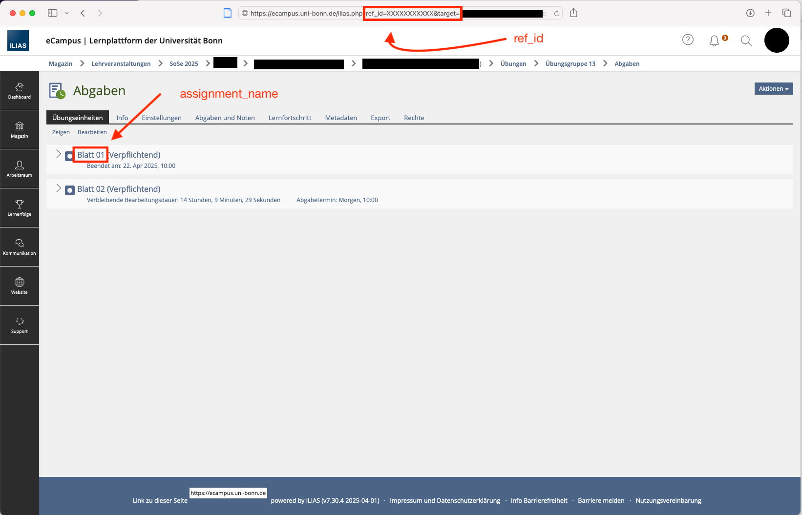

# eCampus-collective-team-feedback-upload

While working as a tutor for the physics department at the university of Bonn,
one minor inconvenience was uploading the group feedbacks for my students.

## Problem
Feedback for group assignments can not be uploaded in one go for the whole "Übgunsgruppe",
this has to be done for each group separately. When having 2 courses, it gets messy and tedious,
this can result in forgetting or even uploading to the wrong feedback to each group.

This is tailored to ILIAS (v7.30.4 2025-04-01) of the University of Bonn which uses the [Shibboleth](https://www.shibboleth.net) login system.
Everything is adjusted to the German language.

## Installation
Use the `requiremnts.txt` to install the required packages, further more [selenium](https://www.selenium.dev) is set up to be used by the Chrome browser

## Usage
### Login
Currently the login does not work with cookies, your credentials can be either put in to `credentials_sample.js` or hardcoded into `ecampus_collective_team_feedback_upload.py`
### Find your course ID
We need the `ref_id=xxxxxx` of the course, where we want to give the feedback and the name of the assignment `assignment_name="Blatt 01"`, if no assignment_name is selected 
it will provide a list of assignments, which will be then saved in `assignments_sample.json`. So if the assignments are already created one can look or use the name from there.

### Upload
In the entry point check `python if __name__ == "__main__": main() ` the attained values have to be inserted, as well as the `folder_path=absolut/folder/path` to the feedback files.
As of now, when downloading all hand-ins at once the following file structure will be created:
`assignment_name/Abgaben/Team YYYYY/firstname_lastname_uniID_UploadID/file.pdf`
It is assumed that the original file contains the feedback.
# Roadmap
[ILIAS v9](https://docu.ilias.de/ilias.php?baseClass=illmpresentationgui&cmd=layout&ref_id=15428&obj_id=209339) seems to have fixed it. 
I will only maintain it, as long as I will be tutoring courses, anyone is free to contribute to it.